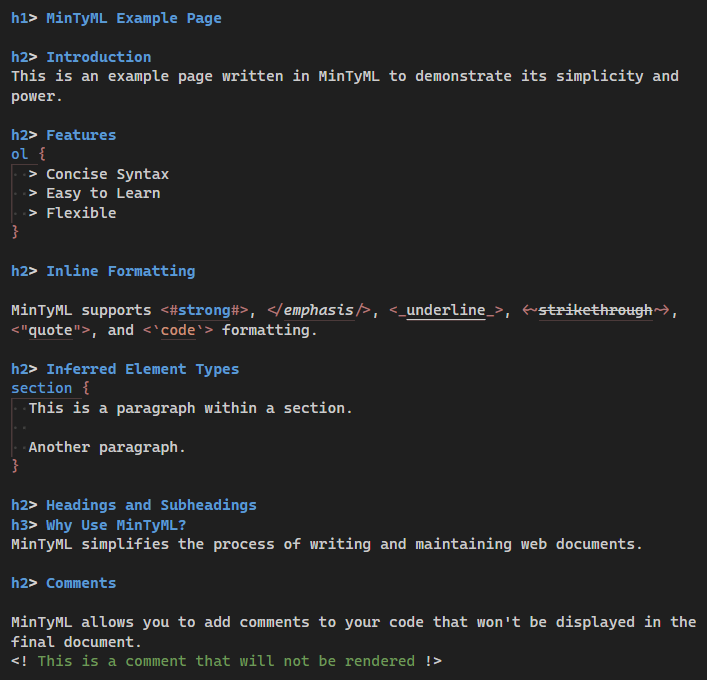

# mintyml README

Support for MinTyML, a minimalist alternative syntax for HTML.
For more information, see the
[GitHub Repository](https://github.com/youngspe/mintyml)

## Features

### Syntax Highlighting

Provides syntax highlighting for MinTyML documents

## Release Notes

### 0.1.0

Initial release
